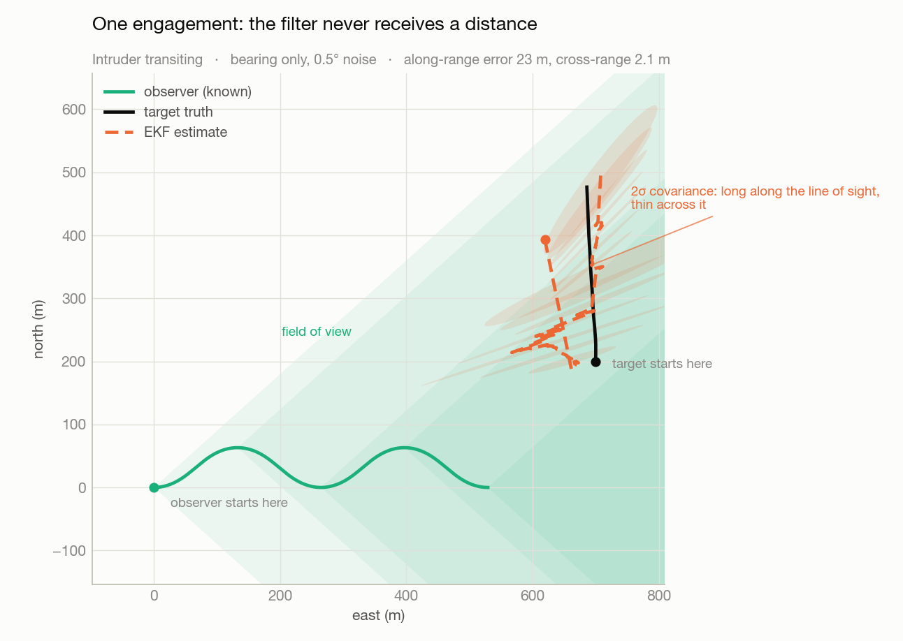
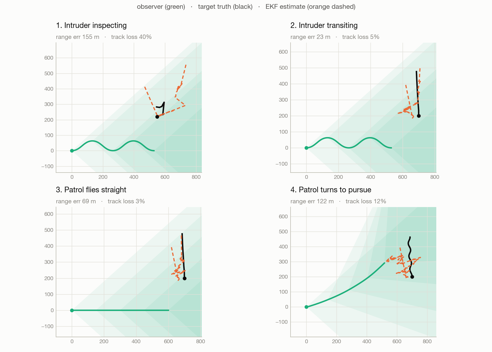
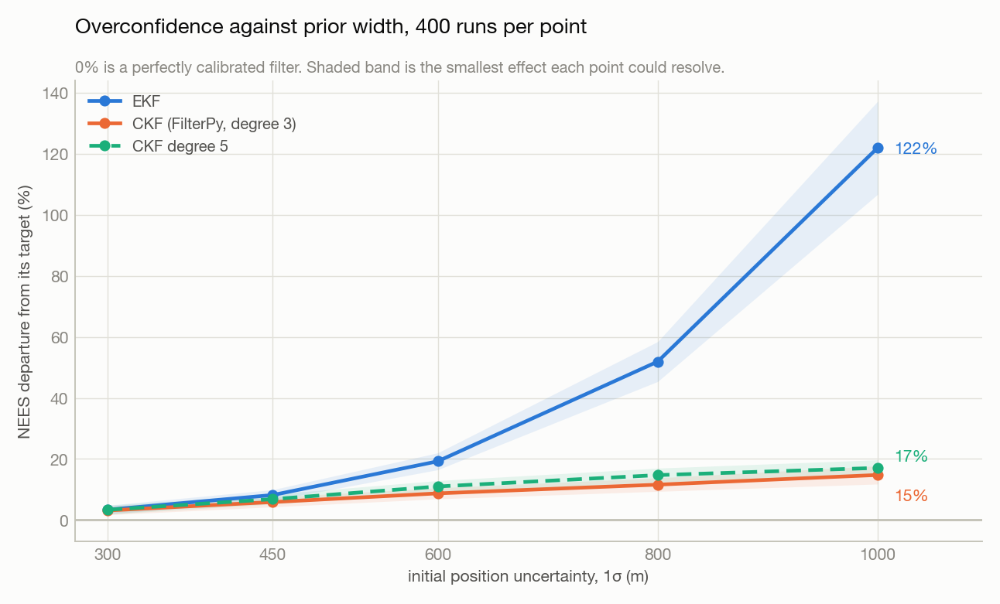

# Bearings-only tracking on a low-cost drone

A simulation harness for comparing an extended Kalman filter against a cubature
Kalman filter on camera-only tracking, where the sensor gives direction and never
distance.

The two questions it answers are in [`report/simulator-report.pdf`](report/simulator-report.pdf):
whether a Kalman filter is usable at all on this sensor, and whether the cubature
filter earns its place over the EKF.

**[Run the scenarios in your browser](https://matthewdegtyar.github.io/bearings-only-tracking/)**
- four geometries, both filters drawn together with their uncertainty ellipses,
and the ensemble comparison underneath. No install, nothing to run.



The observer knows where it is and what direction the target is in. It is never
told how far away the target is. Range comes out of the geometry: the covariance
ellipses are long along the line of sight and thin across it, because a bearing
pins down the direction and says nothing about the distance.

## What the four scenarios show



The scenario that looks cleanest is not the one that tracks best. Case 3 holds
the target in frame almost the whole run, 3 percent track loss, but its observer
flies dead straight, and against a constant-velocity target that geometry cannot
recover range: it improves range error only 20 percent over its starting guess.
Case 2 wins because its observer weaves, which is what makes range observable at
all. Case 1 is the textbook triangulation setup, a static target with a turning
observer, and it comes last because the target leaves the field of view 40
percent of the time.

The geometry that ranges a target and the geometry that keeps it in frame are
not the same geometry.

## EKF against the cubature filter



Both filters are fine when the starting guess is good. They separate as it gets
worse: at 1000 m of initial position uncertainty the EKF understates its own
error by 122 percent while the cubature filter is at 15 percent. That is the
answer to the second question. The EKF is cheaper and adequate when you can
initialise well, and the cubature filter is worth its cost when you cannot.

The degree-5 rule tracks the library degree-3 rule closely here, so the extra
points do not pay for themselves at this operating point.

## The filters are not mine

Both estimators come from [FilterPy](https://github.com/rlabbe/filterpy):
`ExtendedKalmanFilter` and `CubatureKalmanFilter`. `kf2/filters.py` is a thin
adapter that supplies what a bearings-only problem needs on top of them, and
nothing else. Every departure from stock library behaviour is listed in
`kf2.filters.DEVIATIONS` with the reason, and each is tested.

There is one modified estimator, `kf2/ckf5.py`. FilterPy implements the
third-degree cubature rule; that module is the same sampling update at degree 5.
It is named `ckf5` and registered separately precisely so nothing can compare a
library filter against a modified one while calling both "the CKF".

## The work is the harness

Everything that can change a number lives on one frozen `Scenario` dataclass, so
a variant is `replace(scenario, p0_pos=600.0)` and nothing that affects a result
is buried in a module.

| step | cost |
|---|---|
| screen a scenario for viability | 0.4 s |
| one estimator, 50 runs | 1.9 s |
| one estimator, 400 runs | 15 s |
| three estimators, three scenarios | 2.3 min |
| full test suite | ~3 min |

`kf2/health.py` is the screening step, and it exists because every scenario
written for this project was broken at least once in a way that four cheap
numbers would have caught: detection rate, range span, bearing sweep, track loss.

Four things keep the answers honest: the simulator and the filter share no code,
estimators see byte-identical measurements, every result carries the smallest
effect it could have detected, and the consistency test is itself tested against
a filter correct by construction.

## Running it

```sh
pip install numpy scipy filterpy weasyprint pytest

python3 -m pytest -q                                   # ~3 min
python3 scripts/sweep.py                               # initial-uncertainty sweep
python3 scripts/export_cases.py                        # the four scenarios
python3 scripts/make_sim_report.py                     # rebuild the report
python3 scripts/make_readme_figures.py                 # the figures above
python3 scripts/make_viz.py --data results/cases.json \
    --out viz/compare.html --template scripts/viz_compare.html --serve --pages
```

`--pages` also writes `docs/index.html`, which is what GitHub Pages serves. The
page is one self-contained file with the run data inlined: no CDN, no fetch, no
build step.

Every figure and every number in the report is read from the files in
`results/`, so the report cannot drift from the data.

## Layout

```
kf2/filters.py     FilterPy adapters: EKF and CKF, plus the motion and
                   measurement models
kf2/ckf5.py        degree-5 variant, a deliberate departure from the library
kf2/config.py      the Scenario dataclass; everything that changes a number
kf2/scenarios.py   the named scenarios, each with its reasoning
kf2/datagen.py     truth and measurements; shares no code with the filters
kf2/health.py      cheap viability screening, before a sweep is spent
kf2/run.py         one filter loop, shared by the statistics and the figures
kf2/evaluation.py  NEES, NIS, resolution, verdicts
kf2/gating.py      validation gate and association
```

Figures are regenerated from `results/` by `scripts/make_readme_figures.py`, so
they cannot drift from the data they describe.
